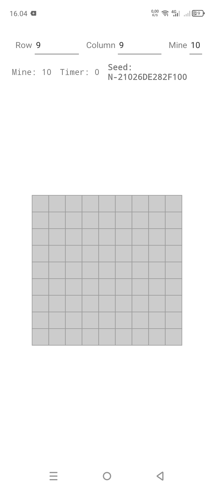
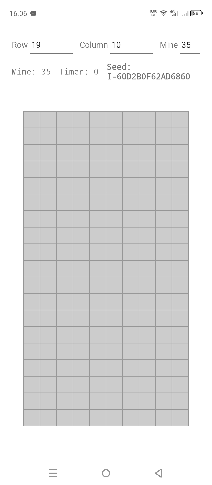

# Minesweeper 64-bit Seed

A Minesweeper implementation written in Kotlin with deterministic board generation.

<table>
<tr>
<td></td>
<td></td>
</tr>
</table>

## Custom Feature

- Seed format `<A-Z>-<0-9A-F>{1,16}`
- Double tap Chord
- Long press to flag cells
- Flood fill cascading
- 2x2 to 30x30 board sizes
- First click safe zone
- Shareable seeds for reproducible board layouts

## Custom Generation

- FNV-1a 64-bit
- SplitMix64 initialization
- xorshift64* RNG
- Fisher-Yates shuffle

## Build

Required JDK 17.

If Gradle 9.5.x Available:

```bash
gradle :app:assembleDebug
```

APK:
`app/build/outputs/apk/debug/app-debug.apk`

Note:
The project deliberately uses Android Gradle Plugin 9.3.0 and Gradle 9.5.0. AGP 9.3 requires Gradle 9.5.0 or later.

